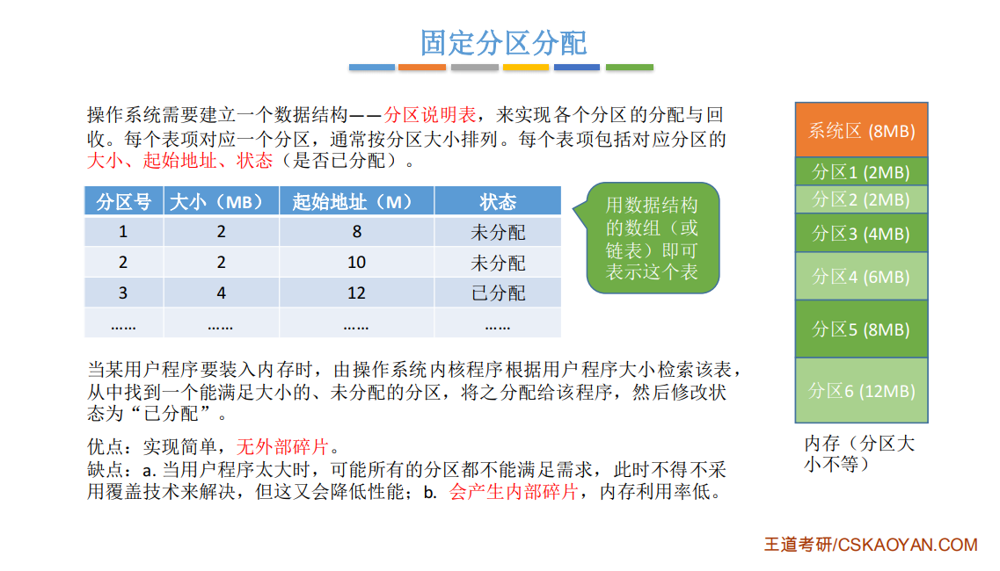
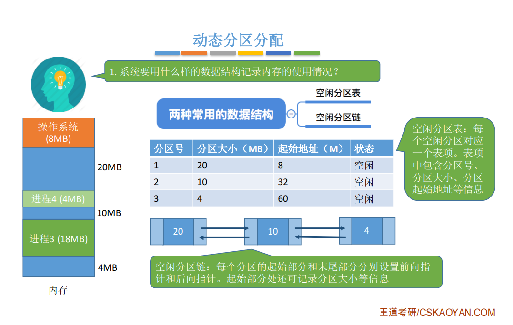
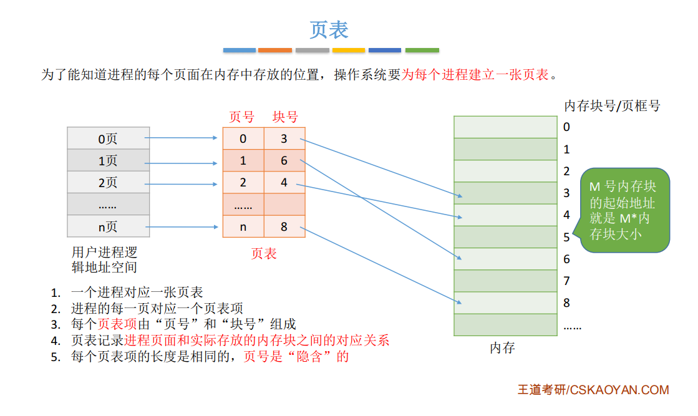
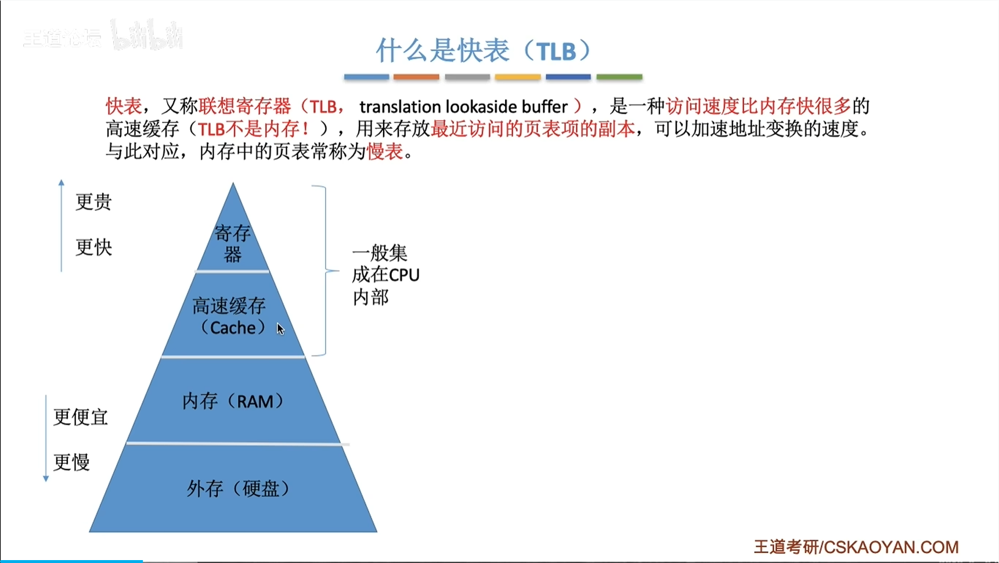
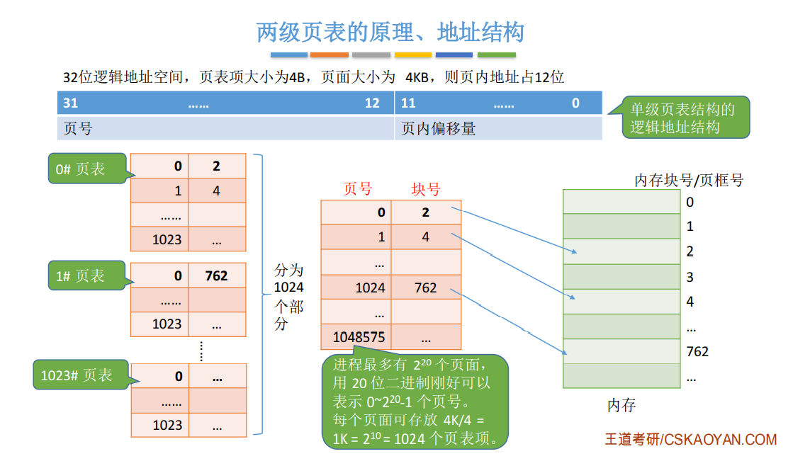
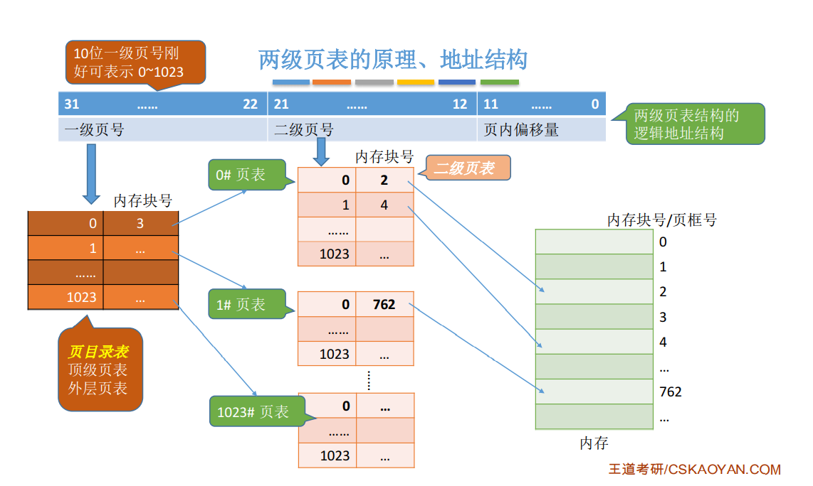
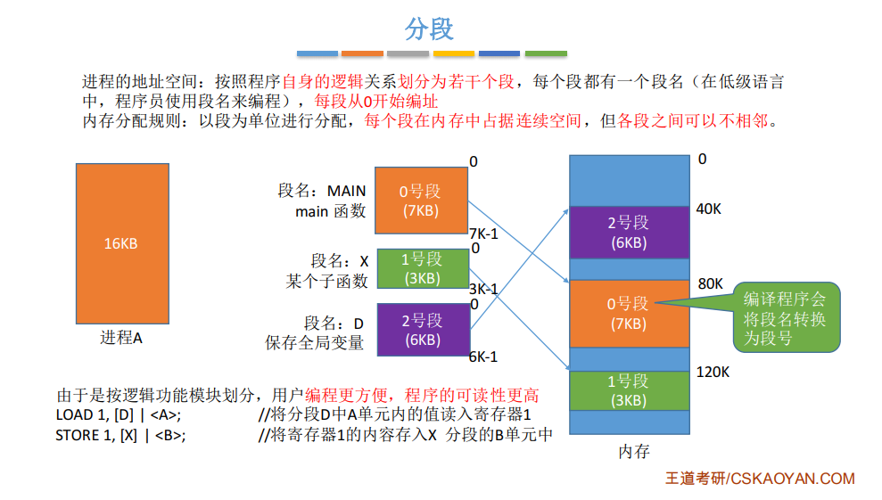
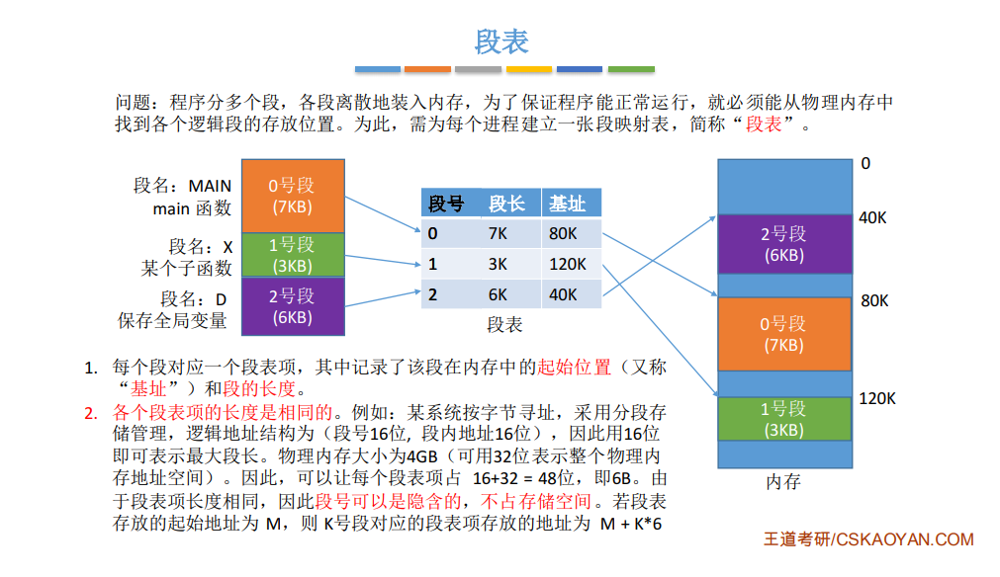
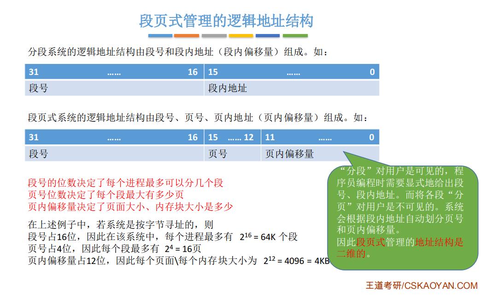
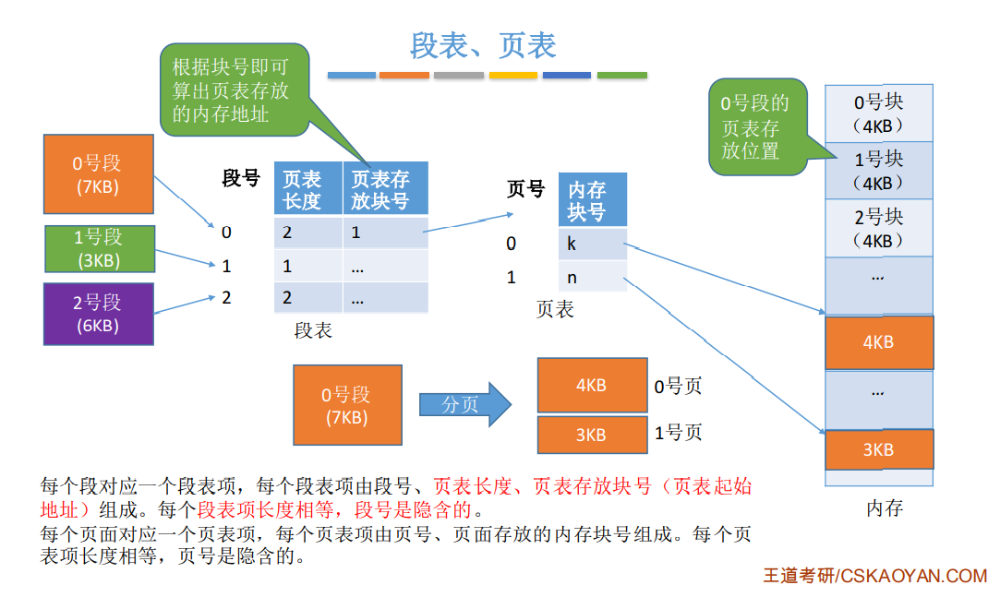

# 内存分配

+ **连续分配**：为用户进程分配的必须是一个连续的内存空间
+ **非连续分配**：为用户进程分配的可以是一些分散的内存空间

## 连续内存分配

+ 内存碎片
  + 内部碎片是指分配给进程的内存空间有部分没有用上
  + 外部碎片指的是内存中某些空间分区由于太小导致难以使用

### 单一连续分配

单一连续分配的实现简单，**不会出现外部碎片**，可以采用覆盖方式扩充内存且可以不需要内存保护措施。但是只能用于单用户单任务的 OS 中，**会出现内部碎片**，存储的的利用率比较低

### 固定分区分配
**分类**

**如何实现及优缺点**

固定分区无外部碎片，但是会产生内部碎片

### 动态分区分配
+ 不会预先划分内存分区，在进程装入内存时，根据进程的大小动态地建立分区
+ 数据结构：
  + 空闲分区表
  + 空闲分区链

动态分区分配没有**内部碎片**，但是有**外部碎片**，但是可以使用**拼凑**技术来解决外部碎片

#### 动态分区分配算法

##### 首次适应算法
***首次适应(first fit，FF)算法***要求空闲分区链（或者空闲分区表）以地址递增的次序链接；
1. 在分配内存时从链首开始顺序查找，直至找到一个大小能满足要求的空闲分区为止；
2. 然后再按照作业的大小，从该分区中划出一块内存空间，分配给请求者，余下的空闲分区仍留在空闲链中；
3. 若从链首直至链尾都不能找到一个能满足要求的分区，则表明系统中已没有足够大的内存分配给该进程，内存分配失败。

+ 该算法倾向于优先利用内存中低址部分的空闲分区，保留了高址部分的大空闲区
+ 缺点是低址部分不断被划分，会留下许多难以利用的外部碎片。而每次查找又都是从低址部分开始的，会导致搜索的时间开销较大

##### 邻近适应算法
+ 为避免低址部分留下许多很小的空闲分区，以及减少查找可用空闲分区的开销，可以使用循环首次适应算法（邻近适应算法）
+ 循环首次适应(next fit，NF)算法在为进程分配内存空间时，是从上次找到的空闲分区的下一个空闲分区开始查找，直至找到一个能满足要求的空闲分区
+ 实现该算法一般会使用循环链表，如果最后一个(链尾)空闲分区的大小仍不能满足要求，则应返回到第一个空闲分区。

##### 最佳适应算法
***最佳适应(best fit，BF)算法***在每次为作业分配内存时，总是把能满足要求、又是最小的空闲分区分配给作业。
该算法要求将所有的空闲分区按其容量以从小到大的顺序形成一空闲分区链，这样第一次找到的能满足要求的空闲区必然是最佳的。 

由于每次分配后所切割下来的剩余部分总是最小的，所以在存储器中会留下许多难以利用的碎片

##### 最坏适应算法
***最坏适应(worst fit，WF)算法***在扫描整个空闲分区表或链表时，总是挑选一个最大的空闲区，从中分割一部分存储空间给作业使用。该算法要求将所有的空闲分区，按其容量以从大到小的顺序形成空闲分区链。

+ 这个算法会使存储器中缺乏大的空闲分区
+ 它的优点是可使剩下的空闲区不至于太小，产生碎片的可能性最小，对中、小作业有利
+ 同时最坏适应分配算法查找效率很高，查找时只要看第一个分区能否满足作业要求即可

## 非连续内存分配

### 分页存储

+ 将内存空间分为一个个大小相等的分区，每个分区就是一个页框（物理块），页框号（物理块）从0开始
+ 将用户进程的地址空间分为与页框大小相等的一个个区域，称为页或页面，页号也是从0开始
> PS：页框(物理块)不能太大，否则可能产生过大的内存碎片

> 为什么页号是“隐含的”？
> 各页表项会按照顺序连续地存放在内存中，只需要知道页表存放的起始地址和页表项长度，即可以找到各个页号对应的页表项

**如何根据逻辑地址得到物理地址？**
转换核心逻辑
+ 物理地址 = 物理块号 × 页面大小 + 页内偏移量
+ 页号 (P) = 逻辑地址 / 页面大小
+ 物理块号通过查询页表得到
+ 页内偏移量 (W) = 逻辑地址 % 页面大小

所以，这里如果要访问逻辑地址对应的单元，需要2次访存
1. 查页表
2. 访问目标内存单元

#### 快表（TLB）

#### 两级页表

### 分段存储

### 段页式

