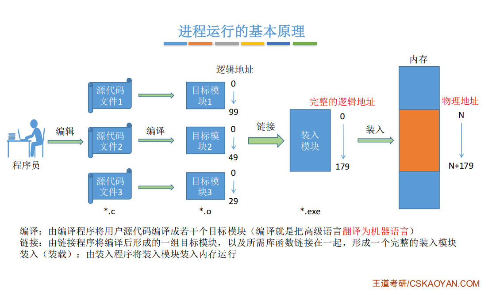
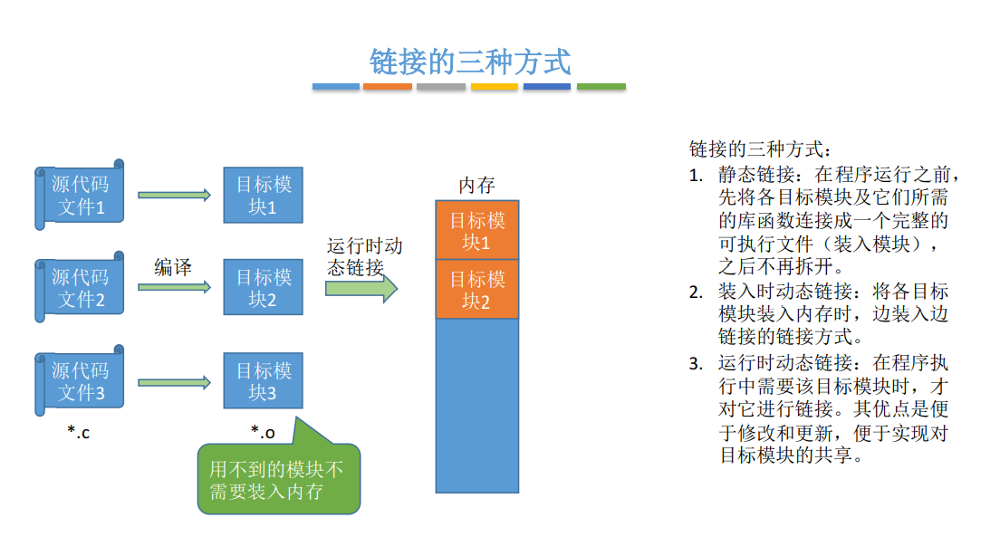

# 内存基础知识

## 一、什么是内存？
内存可存放数据；程序执行前需要先放到内存中才能被CPU处理，用来缓和CPU与硬盘之间的速度矛盾

## 二、逻辑地址转换物理地址

三种方式:

1. **绝对装入**
2. **静态重定位**
3. **动态重定位**

### 绝对装入

**绝对装入**：在编译时，如果知道程序放到内存中哪个位置，编译程序将产生绝对地址的目标代码，装入程序按照装入模块的地址，将程序和数据装入内存

+ 绝对装入只适合**单道程序环境**
+ 程序中使用绝对地址，可在编译或汇编时给出，也可由程序员直接赋值。通常情况下都是编译或者汇编时再转换成绝对地址

### 静态重定位

静态重定位：又称可重定位装入。编译、链接后的装入模块的地址都是从0开始的，指令中使用的地址、数据存放的地址都是相对于起始地址而言的逻辑地址。可根据内存的当前情况，将装入模块装入到内存的适当位置。装入时对地址进行“重定位”，将逻辑地址变换为物理地址（地址变换是在装入时一次完成的）

> 人话就是：逻辑地址从0开始，当转化为物理地址时，假设装入的起始物理地址是100，则物理地址=逻辑地址+100

+ 地址变换是在装入时一次完成的
+ 缺点：在一个作业装入内存时，**必须分配其要求的全部内存空间**，如果没有足够的内存，就不能装入该作业。作业一旦进入内存后，**在运行期间就不能再移动**，也**不能再申请内存空间**

### 动态重定位

动态重定位：动态重定位，又称**动态运行时装入**。编译、链接后的装入模块的地址都是从0开始的。装入程序把装入模块装入内存后，**并不会立即把逻辑地址转换成物理地址**，而是**把地址转换推迟到程序真正要执行时才开始**。因此装入内存后的所有地址**依然是逻辑地址**。这种方式需要一个**重定位寄存器**的支持

+ 采用动态重定位时**允许程序在内存中发生移动**

## 三、进程运行的基本原理

