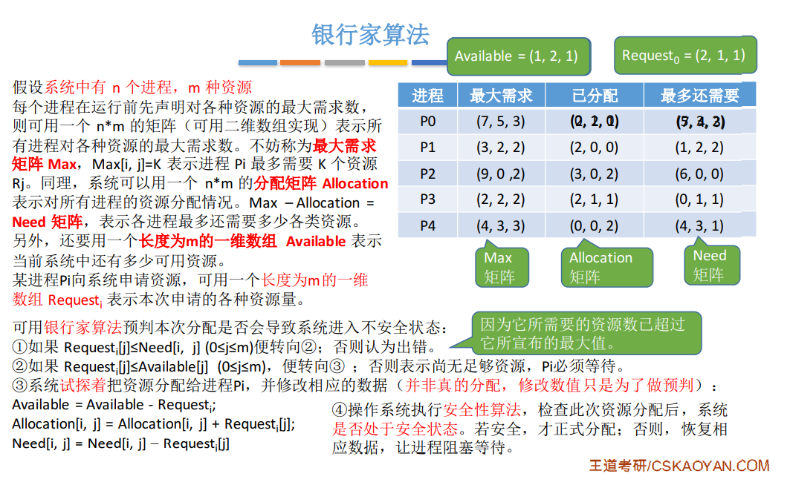
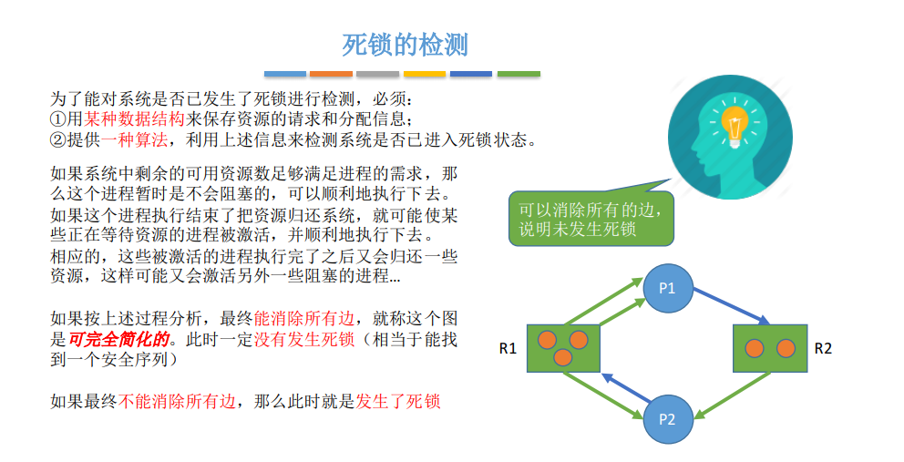
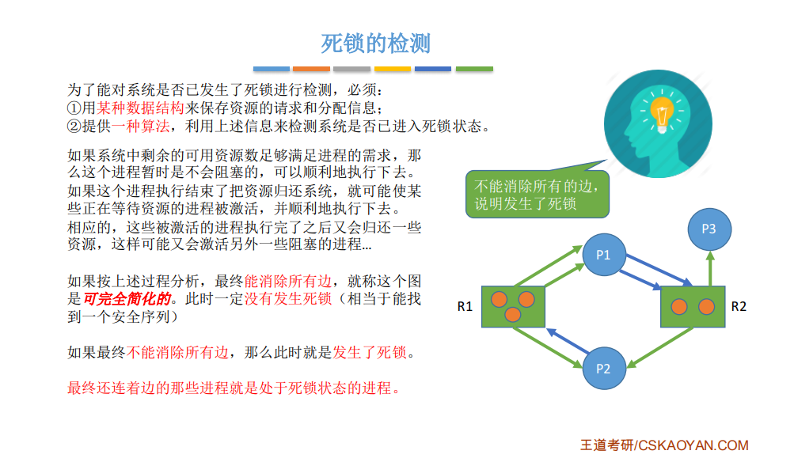
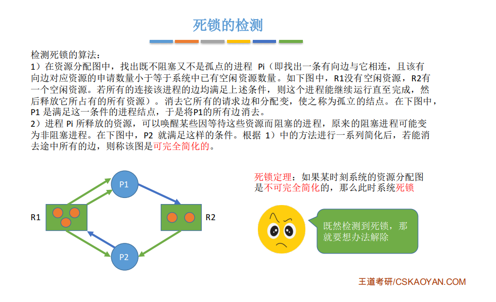
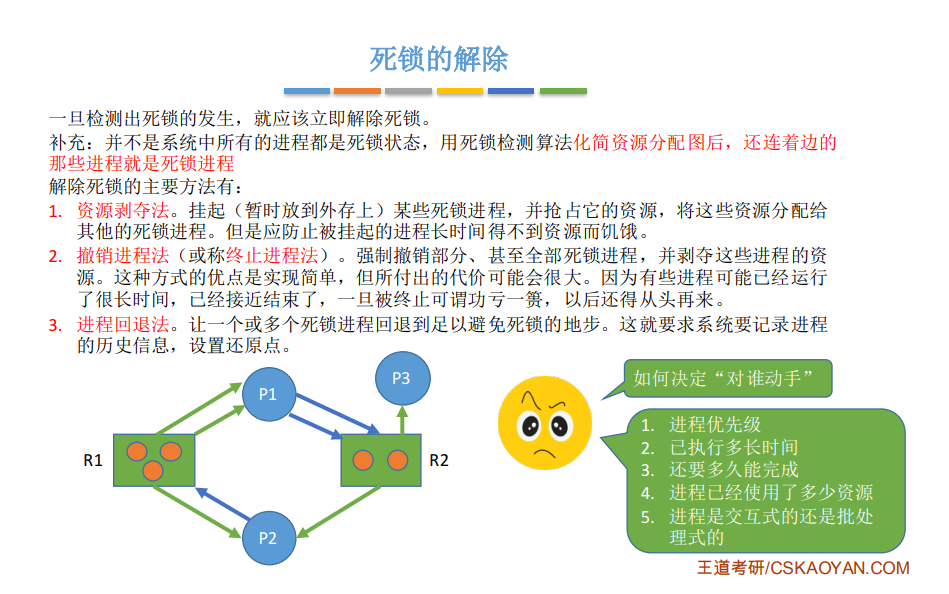

# 死锁

## 一、什么是死锁？

各个进程互相等待对方手里的资源，导致各个进程都阻塞，无法向前推进的现象

## 二、死锁发生的必要条件

产生死锁**必须同时满足以下四个条件**，只要其中任一条件不成立，死锁就不会发生

+ **互斥**：只有对必须互斥使用的资源的争抢才会导致死锁
+ **不剥夺**：进程所获得的资源在未使用完之前，不能由其他进程强行夺走，只能主动释放
+ **请求和保持**：进程**已经保持了至少一个资源**，但是又提出了新的资源**请求**，而该资源又被其他进程占有，此时请求进程被阻塞，但又对自己已有的资源**保持**不放
+ **循环等待**：存在一种进程**资源的循环等待链**，链中的每一个进程已获得的资源同时被下一个进程所请求

*发生死锁时一定有循环等待，但是发生循环等待时未必死锁*

如果同类资源数大于1，则即使有循环等待，也未必发生死锁。但是如果系统中的每类资源都只有1个，那循环等待就是死锁的充分必要条件

## 三、什么时候会发生死锁

+ 对系统资源的竞争
+ 进程推进顺序非法
+ 信号量使用不当

总之，对不可剥夺资源的不合理分配，可能导致死锁

## 四、死锁处理策略

+ 预防死锁：破坏死锁产生的四个必要条件的一个或几个
+ 避免死锁：用某种方法防止系统进入不安全状态，从而避免死锁（银行家算法）
+ 死锁的检测和接触：允许死锁发生，不过操作系统会负责检测出死锁的发生，然后采取措施解除死锁

### 4.1 预防死锁

**破坏互斥条件**

如果把只能互斥使用的资源改造为允许共享使用，则系统不会进入死锁状态，比如SPOOLing技术

*缺点*：并不是所有的资源都可以改造成可共享使用的资源。并且为了安全，很多地方还必须保护这种互斥性。因此，很多时候都无法破坏互斥条件

**破坏不剥夺条件**

*方案一*：当某个进程请求新的资源得不到满足时，它必须立即释放保持的所有资源，待以后需要时再重新申请

*方案二*：当某个进程需要的资源被其他进程所占有的时候，可以由操作系统协助，将想要的资源强行剥夺。这种方式一般需要考虑哦各进程的优先级

*缺点*：实现复杂、释放已获得的资源可能导致前一阶段的工作失效、反复申请和释放资源会增加系统开销、容易导致饥饿

**破坏请求和保持条件**

采用*静态分配方法*，即进程在运行前一次申请完它所需要的全部资源，在它的资源未满足前，不让他投入运行。

*缺点*：如果进程整个运行期间都一直保持着所有资源，就会造成严重的资源浪费，资源利用率低；可能导致饥饿

**破坏循环等待条件**

采用*顺序资源分配法*，首先给系统中的资源编号，规定每个进程必须按编号递增的顺序请求资源，同类资源（编号相同的资源）一次申请完

### 4.2 避免死锁

使用***银行家算法***

#### 银行家算法

**银行家算法**的核心思想就是**在资源分配之前预先判断这次分配是否会导致系统进入不安全状态**，**如果会进入安全状态，就分配，否则，就回滚**

### 4.3 死锁的检测和解除

#### 死锁检测

**未发生死锁的情况**

**发生死锁的情况**

**总结：**

#### 死锁解除

